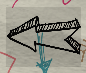

# **<u>EL AHORCADO</u>**

---
## INTEGRANTES
DOJO 1
- Diego Barua Benítez
- Tomas Benítez
---

## GAMEPLAY

Link del gameplay: [GAMEPLAY](https://youtu.be/Nvl2mng_I6w)

## :rocket: **PANTALLAS**

### Menu
Esta es la pantalla que se mostrará al dar inicio al programa. Tendremos la opción de seleccionar dos opciones:
- Jugar
- Scores

- 

### Mejores Puntajes
Al presionar el botón de Scores en el Menú Principal, se mostrarán en una nueva pantalla los 10 mejores puntajes.

- 

Para volver al menú principal, simplemente hay que presionar la flecha ubicada en la izquierda superior de la pantalla.

### Jugar
Si presionamos JUGAR desde el menú principal, nos llevará a la pantalla donde transcurre el juego

En esta pantalla tendremos:
- Un teclado virtual para que el usuario pueda ingresar las letras con el mouse

- Un recuadro donde el usuario va a poder ingresar las letras de otra manera, mediante el teclado

- Dos recuadros en las esquinas superiores de la pantalla, uno para indicar el tiempo restante y el otro para indicar el puntaje
 
 
 

- En la parte central superior encontraremos 3 comodines con diferentes funcionalidades cada uno

- Por debajo de los comodines tendremos un recuadro en donde nos indicará la temática de la palabra a adivinar

- Y por último, al centro de la pantalla se nos irá dibujando la figura del ahorcado, cada vez que no acertemos una letra

### Ganar o Perder
Cuando el nivel se termine, ya sea por acertar la palabra, porque se terminó el tiempo o por haber utilizado todos los intentos sin éxito, se mostrará una pantalla nueva, en donde se le requerirá al usuario ingresar una letra para continuar.
- Si gana, se le mostrará la siguiente pantalla:

- Si pierde, por tiempo o por intentos, se le mostrará al usuario esta otra pantalla, con su puntaje final:

### Nickname
Esta pantalla se mostrará solamente si el usuario pierde. Se le pedirá que ingrese un nickname para poder guardar su puntaje con el mismo. Una vez ingresado, se volverá al Menú Principal

## :rocket: **INSTRUCCIONES DEL JUEGO**

El juego sigue las reglas del ahorcado tradicional: ingresar una letra y si está, se revela su posición en la palabra incógnita, sino se resalta la letra para no volver a ingresarla de vuelta y se dibuja una porción del ahorcado con la persona colgando. Pero, tiene algunas variantes que nombraremos a continuación:

### Temáticas
- La palabra a adivinar estará relacionada a una temática que se mostrará en pantalla

### Rondas/Niveles
- El juego no terminará hasta que el usuario pierda. ¿Qué quiere decir esto? Si el usuario adivina una palabra, el juego sigue con otra palabra que estará relacionada a otra temática. Esto será un suceso que se cortará solamente si el usuario no adivina la palabra.
- Una vez terminada la ronda, para poder continuar, tanto si ganó o perdió, el usuario deberá tocar una tecla cualquiera.

### Tiempo
- El juego es por tiempo. Para cada ronda el usuario tendrá 60 segudos para adivinar la palabra.

### Puntaje
- Por cada letra correcta que se ingrese, el usuario sumará 10 puntos. Esto no varía si hay más de una en la palabra.
    - Ejemplo: la palabra es ANANA, si el usuario ingresa la A, solamente se sumarán 10 puntos
- Por cada letra incorrecta que se ingrese, el usuario restará 5 puntos y perderá uno de los 8 intentos que tiene.
- El puntaje restante por ronda se sumará al puntaje

### Comodines
- 30 segundos: el "Comodín de los 30 segundos" te suma 30 segundos a tu tiempo restante actual.

- Revelar letra: el "Comodín de revelar letra" te revela una letra random en la palabra. Si la palabra tiene más de una de la letra que se reveló, solamente adivina UNA de esas. 
    - Ejemplo: la palabra es KOMODO, si se utiliza el comodín de revelar letra, y te revela la O, solamente revelará una de las posiciones de las 3 que hay en la palabra. La palabra en pantalla quedaría " K _ M O D _ ". Esto sigfinica que todavía se puede ingresar la letra O por teclado o teclado virtual.

- Multiplicar tiempo: el "Comodín de multiplicar tiempo" tiene efecto en el puntaje. Te duplica el tiempo restante de la ronda y te lo suma al puntaje. Tendrá efecto solamente si el jugador gana esa ronda. Se podrá utilizar exclusivamente en los primeros 10 segundos de cada ronda (si es que no fue utilizado antes). 

### Ingreso de letras
- Mediante teclado:
    - Ingresar tecla con el teclado y para chequear si es correcta o no, presionar Enter. 
        Si es correcta, reemplazará los guiones de la palabra en donde esté la letra ingresada, y aparecerá circuleada con color verde en el teclado virtual.
        Si es incorrecta, solamente aparecerá tachada en el teclado virtual
    - Nota: ingresar dos veces una misma letra no tendrá efecto alguno en el juego, pero el tiempo corre, así que no te recomendamos que pierdas tiempo reingresando la misma letra más de una vez. 
- Mediante teclado virtual con el mouse
    - Cliquear la letra deseada. Si es correcta o incorrecta utilizará el mismo procedimiento que el teclado, se mostrará en el teclado virtual.